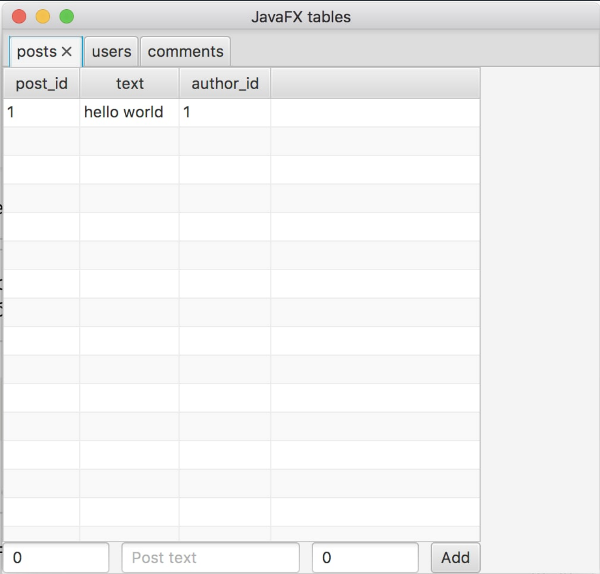
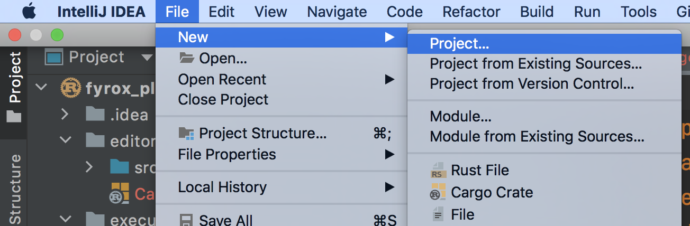
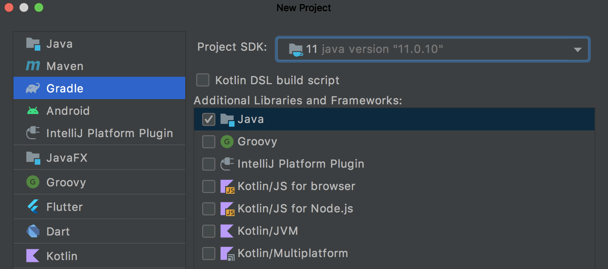
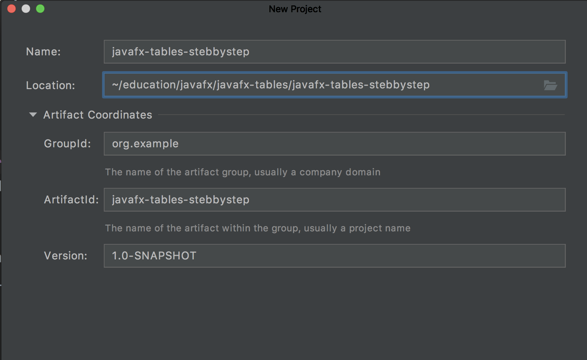
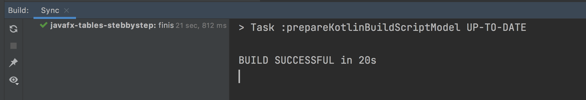
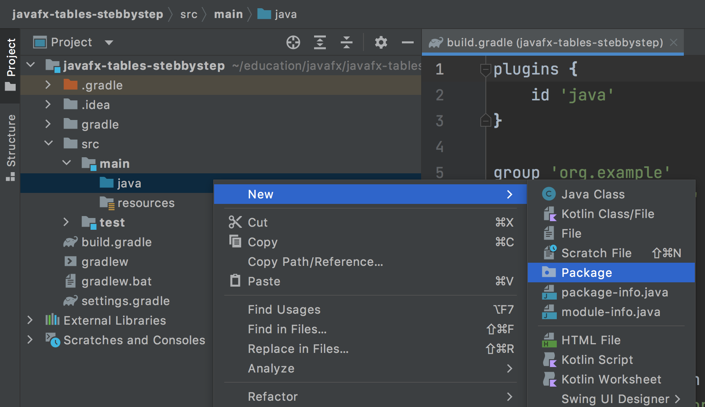
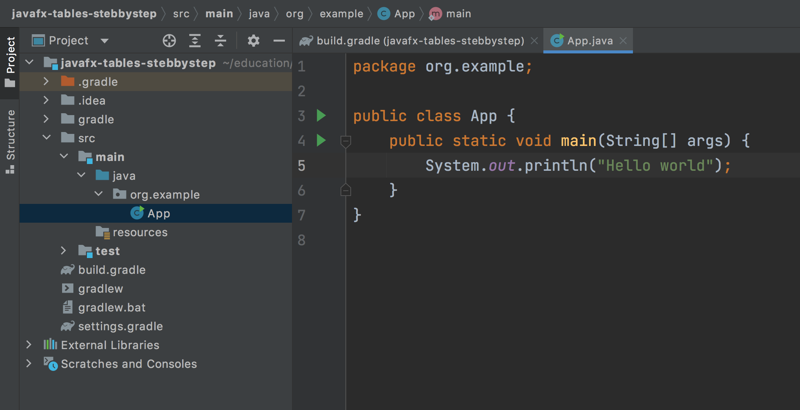
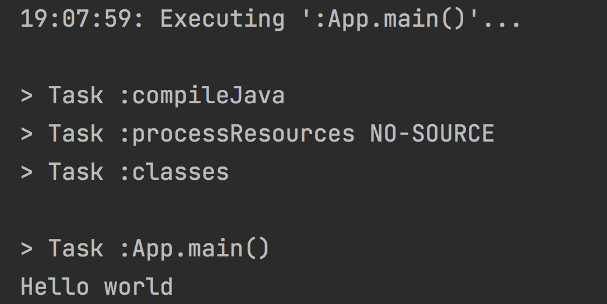

# Cерия уроков по разработке приложения на JavaFX

В этом цикле уроков я покажу, как начать работать с **JavaFX** и начать делать первые приложения.
Целью этих уроков будет создать программу, которая отображает несколько таблиц (наподобии **SQL**) и переход между ними используя ключи. И кроме этого, мы используем **excel** файл как хранилище (**источник**) данных!

Вот такая программа должна получиться

## Что нужно знать перед началом?

* Вы умеете работать в Idea, создавать и настраивать проекты
* Знаете синтаксис джавы на уверенном уровне, пользуетесь классами и аннотациями
* Знаете синтаксис [groovy](https://www.google.com/search?q=groovy&oq=groovy) для настройки сборки проекта в [gradle](https://www.google.com/search?q=gradle)

### Что такое JavaFX? 
Это кроссплатформенный фреймворк для разработки программ с GUI (Graphical User Interface), проще говоря, с окнами. С помощью графического интерфейса можно отображать данные и обрабатывать пользовательский ввод с мышки  и клавиатуры. JavaFX состоит из семейства компонентов, которые можно использовать для разработки приложений: кнопки, меню, сетки, таблицы итд. 
JavaFX позволяет создавать интерфейс **программно**, средствами Java, либо с помощью _XML_ подобного языка, внутри **.fxml** файлов. Я буду использовать второй способ.

## Урок 1. Создание шаблона проекта

Первое, что нужно сделать — проект **gradle**, внутри которого мы потом разместим само приложение.
Почему именно gradle? Ведь Idea предоставляет готовый JavaFX шаблон. В целом да, но я не доверяю такие вещи среде разработки, чтобы меньше от нее зависеть. Используя gradle, я получу воспроизводимую сборку и такой проект будет работать на любой машине, а не только у меня и только в той версии Idea, которую использовал я.

Создайте проект с помощью меню:

Выберите слева тип проекта **Gradle** и 11 версию Java. Если у вас такой нет, можно выбрать другую, но желательно выше 8 версии (включительно):

Задайте имя проекта. Artifact Coordinates по-умолчанию:

Проект готов, осталось дождаться, пока gradle завершит инициализацию!

Если вы увидели похожую надпись, значит все ок, можно продолжать.

### Точка входа

Чтобы убедиться, что проект не только собирается, но и запускается, я добавлю точку входа (метод _main_).

Но сначала, нужно сделать package (директорию) для классов. У меня это будет `org.example`, тк я указал это значение в _GroupId_ при создании проекта. Это важно, обращайте на это внимание, и не только в этом проекте. Часто именно это является приичиной ошибок при работе с Java проектами.
Итак, нажмите правой кнопкой мыши по папке java->New->Package и введите имя директории с кодом [`org.example`]:

Теперь осталось сделать файл App. Кликните правой кнопкой по org.example->New->Java Class и введите App. Внутри должно быть следующее содержимое:

Обратите внимание на два зеленых треугольника напротив номера строки. Если их у вас нет — значит с проектом что-то не так.

Запустите проект, нажав на треугольник. Если вы в терминале увидели `Hello world` значит проект отработал успешно.

Продолжим в уроке 2

Обсуждение урока в телеграмм канале

