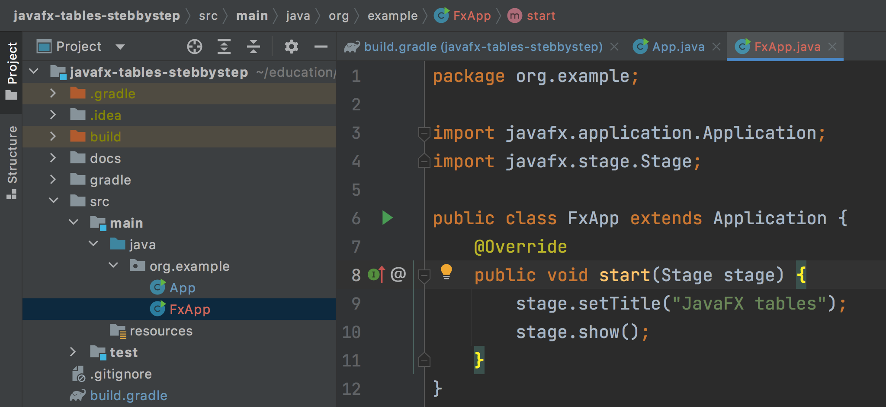
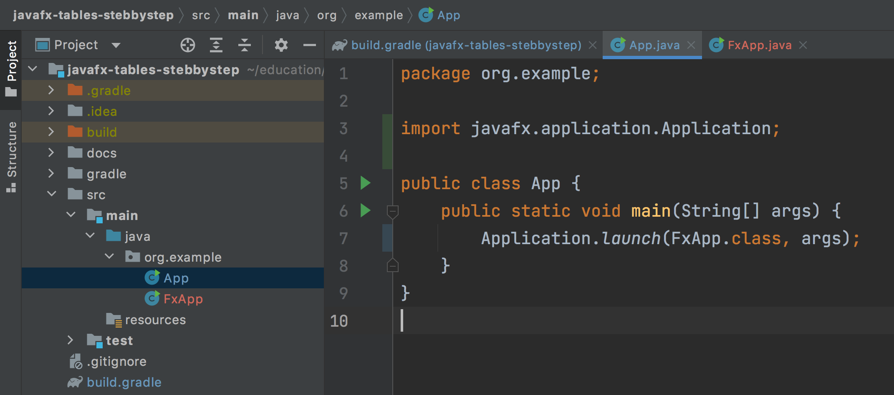

### Урок 2. Подключение JavaFX к проекту

### Настройка файла build.gradle

Для того чтобы подключить JavaFX, нужно добавить ее плагин в gradle. Для этого нужно модифицировать секцию плагинов:
```groovy
plugins {
    id 'java'
    id 'application'
    id 'org.openjfx.javafxplugin' version '0.0.10'
}
```

Также нужно указать, какую версию JavaFX использовать и необходимые модули:
```groovy
javafx {
    version = "17.0.1"
    modules = [ 'javafx.controls', 'javafx.fxml' ]
}
```

Не забудьте синхронизировать настройки gradle, нажав на кнопку:


### Теперь у вас есть JavaFX! 
Осталось сделать еще одну точку входа и немного модифицировать файл `App`

Создайте новый файл FxApp:

Несмотря на то, что Idea предлагает запустить этот файл, не поддавайтесь на провокацию. Мы будем запускать всегда через App.

Чтобы новый класс заработал, его нужно запустить:


Теперь можно запустить. Вы должны увидеть такое окошко:


Если вы хотите, чтобы проект запускался командой `gradle run`, нужно указать _mainClass_. Нужно вставить новую секцию application секцию, после секции javafx в файле `build.gradle`:
```groovy
application {
    mainClassName = "org.example.App"
}
```
Исходный код смотрите в файлах проекта. 


В следующем [уроке](../lesson3/index.md) мы добавим `.fxml` файл и опишем структуру таблицы. 

Обсуждение 2 урока в телеграмм канале

Урок 3