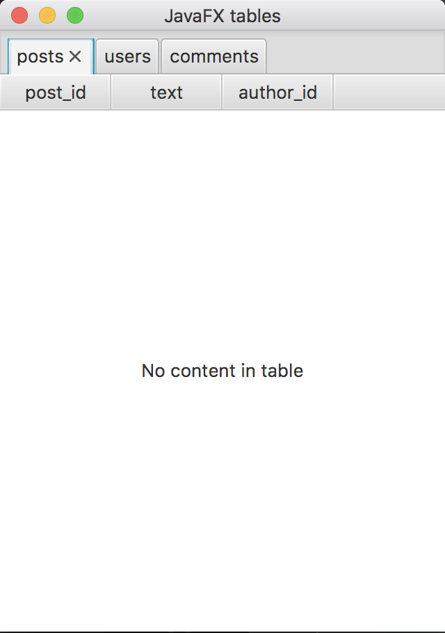
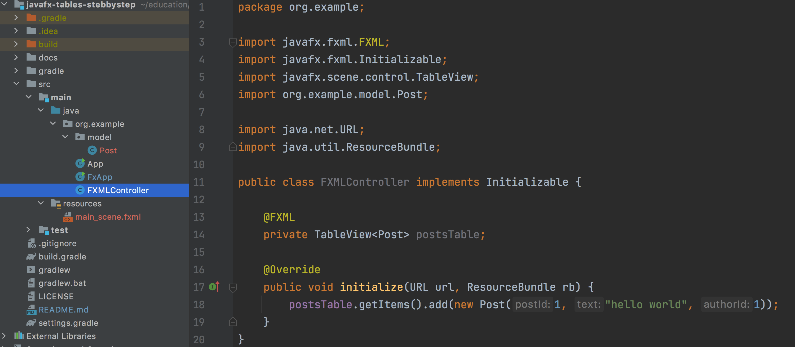
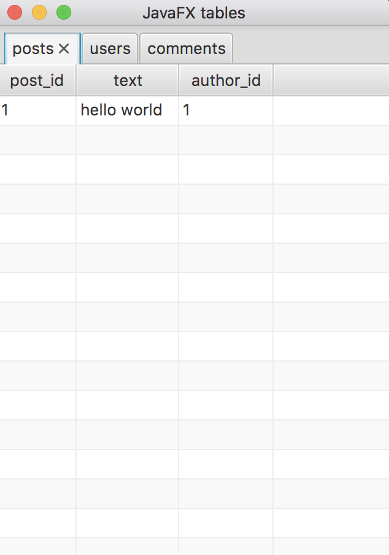

# Урок 3. Создание интерфейса

Одна из возможностей JavaFX — описание интерфейса внутри XML файлов, чем мы и займемся в этом уроке.
Если вы знакомы с HTML, вам будет легко понять, что к чему. 


Что здесь можно увидеть? Первое, что можно сделать — вкладки `posts`, `users`, `comments`. 
За отображение вкладок в JavaFX отвечает `TabPane`, поэтому начнем именно с нее.
Создайте файл `main_scene.fxml` внутри `/src/main/resources` со следующим содержимым:
```xhtml
<?xml version="1.0" encoding="UTF-8"?>

<?import javafx.scene.control.TableView?>
<?import javafx.scene.control.TabPane?>
<?import javafx.scene.control.Tab?>
<?import javafx.scene.control.TableColumn?>
<?import javafx.scene.layout.GridPane?>


<GridPane xmlns:fx="http://javafx.com/fxml">
    <TabPane>
        <Tab text="posts">
            <TableView>
                <columns>
                    <TableColumn text="post_id"/>
                    <TableColumn text="text"/>
                    <TableColumn text="author_id"/>
                </columns>
            </TableView>
        </Tab>
        <Tab text="users">
            <TableView>
                <columns>
                    <TableColumn text="user_id"/>
                    <TableColumn text="name"/>
                </columns>
            </TableView>
        </Tab>
        <Tab text="comments">
            <TableView>
                <columns>
                    <TableColumn text="commentId"/>
                    <TableColumn text="post_id"/>
                    <TableColumn text="author_id"/>
                    <TableColumn text="text"/>
                </columns>
            </TableView>
        </Tab>
    </TabPane>
</GridPane>
```
Чтобы JavaFX отрисовала этот файл, нужно его загрузить внутри `FxApp`:
```java
package org.example;

import javafx.application.Application;
import javafx.fxml.FXMLLoader;
import javafx.scene.Parent;
import javafx.scene.Scene;
import javafx.stage.Stage;

import java.io.IOException;

public class FxApp extends Application {
    @Override
    public void start(Stage stage) throws IOException {
        Parent root = FXMLLoader.load(ClassLoader.getSystemResource("main_scene.fxml")); //наш новый файл

        Scene scene = new Scene(root);

        stage.setTitle("JavaFX tables");
        stage.setScene(scene);
        stage.show();
    }
}
```
Теперь можно запускать. Должно получиться вот так:


Отлично, у нас есть таблицы, теперь нужно сделать классы (сущности), которыми будем их заполнять.
Я сделаю три класса внутри `org.example.model`: `Post`, `User` & `Comment`:
```java
package org.example.model;

public class Post {
    private final Integer postId;
    private final String text;
    private final Integer authorId;

    public Post(Integer postId, String text, Integer authorId) {
        this.postId = postId;
        this.text = text;
        this.authorId = authorId;
    }

    public Integer getPostId() {
        return postId;
    }

    public String getText() {
        return text;
    }

    public Integer getAuthorId() {
        return authorId;
    }
}
```
Реализацию `User` & `Comment` оставляю на домашнее задание.

Теперь еще одна важная деталь о которой я не упомянул — контроллер.
Благодаря **fxml** у нас есть возможность описывать интерфейс, но он пустой, без данных. Как их добавить туда?
Для этого, нам нужен программный доступ к таблице, аналог метода `document.getElementById` из HTML.
Для этих целей служит контроллер: мы привязываем таблицу через специальный аттрибут **id** и получаем возможность работать с ней из кода.
В частности, добавлять данные. Итак, сделайте еще один файл — `FXMLController`, в котором будут хранится биндинги для всех элементов управления: вкладки, кнопки, таблицы итд.

Обратите внимание на 14 строку, название переменной `postsTable` должно в точности совпадать с тем, что вы укажите в **fxml** файле:
```xhtml
...
<GridPane xmlns:fx="http://javafx.com/fxml" fx:controller="org.example.FXMLController">
    <TabPane>
        <Tab text="posts">
            <TableView fx:id="postsTable">
                <columns>
                    <TableColumn text="post_id"/>
                    <TableColumn text="text"/>
                    <TableColumn text="author_id"/>
                </columns>
            </TableView>
        </Tab>
        ...
```
`fx:id="postsTable"` этот аттрибут привяжет `TableView` к переменной в контроллере.
Не забудьте также указать аттрибут `fx:controller` у `GridPane`.
Теперь мы можем управлять этой таблицей! 

Well, not yet.
Если вы запустите программу, то ничего не изменилось, хотя должен был появиться пост с текстом `hello worod`.
Почему так? Потому что, несмотря на то, что класс `Post` был добавлен в `TableView`, он не может отобразиться без дополнительных инструкций.
А именно, нужно сопоставить каждое поле в классе `Post` с колонкой в таблице.
Для этого нужно модифицировать `TableView` следующим образом:
```xhtml
    <TableView fx:id="postsTable">
        <columns>
            <TableColumn text="post_id" >
                <cellValueFactory><PropertyValueFactory property="postId" /></cellValueFactory>
            </TableColumn>
            <TableColumn text="text">
                <cellValueFactory><PropertyValueFactory property="text" /></cellValueFactory>
            </TableColumn>
            <TableColumn text="author_id">
                <cellValueFactory><PropertyValueFactory property="authorId" /></cellValueFactory>
            </TableColumn>
        </columns>
    </TableView>
```
Сопоставление задается с помощью элементов `cellValueFactory` & `PropertyValueFactory` в которых указаны поля (из класса `Post`) для каждой колонки.


Так-то лучше! Настройку остальных таблиц тоже оставляю на домашнее задание. 

В следующем уроке я добавлю возможность перемещения между таблицами по клику (например author_id).