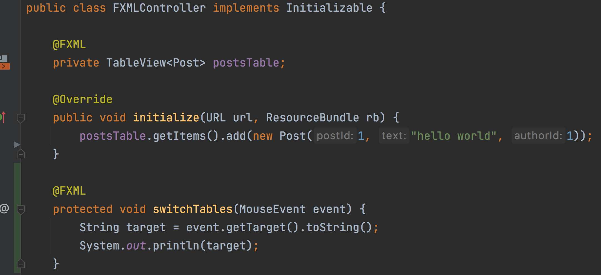

# Урок 4. Переход между таблицами

Первым делом надо сказать, что нативного/правильного способа сделать переходы по клику между таблицами нет. Либо я его не нашел 🤷‍♂️.
Поэтому, в рамках своей задачи, я сделал что-то вроде костыля, но он стабильно работает.
Минус моего подхода в том, что с ростом количества данных в таблицах, скорость перехода будет снижаться (алгоритмическая сложность _О(n)_).

В начале, я объявил метод `switchTables`, который будет срабатывать при клике:


Чтобы подключить его к таблицам, нужно добавить обработчик события `onMouseClicked` у компонентов `TableView`: 
```xhtml
<TableView fx:id="postsTable" onMouseClicked="#switchTables">
```

Проделайте туже операцию для таблицы комментариев, при этом добавив атрибут `fx:id="commentsTable"`:
```xhtml
<TableView fx:id="commentsTable" onMouseClicked="#switchTables">
```
Не забудьте добавить `commentsTable` в контроллер:
```java
@FXML
private TableView<Comment> commentsTable;
```
Обратите внимание, что обработчики нажатий нужны только для таблиц постов и комментариев, тк таблица пользователей не содержит ссылок на другие таблицы.

Теперь при клике мышки внутри таблицы, вы будете видеть в консоли примерно следующее:
```
TableColumn$1$1[id=null, styleClass=cell indexed-cell table-cell table-column]'1'
Text[text="hello world", x=0.0, y=0.0, alignment=LEFT, origin=BASELINE, boundsType=LOGICAL_VERTICAL_CENTER, font=Font[name=System Regular, family=System, style=Regular, size=13.0], fontSmoothingType=LCD, fill=0xffffffff]
TableColumn$1$1[id=null, styleClass=cell indexed-cell table-cell table-column]'1'
```

## Как работает переход?

Первое, что нужно сделать — это понять, где именно произошел клик, в какой колонке?
Тк JavaFX не позволяет поставить обработчик клика на отдельную колонку (или ячейку), мы должны получить эту информацию сами из контекста.
Опираясь на вывод консоли выше можно точно сказать, когда произошел клик по колонке с текстом (2 строка).

### Как быть с остальными колонками?

`TableColumn$1$1[id=null` здесь мы видим не уникальное название класса и поле `id` равное `null`.
При этом, если менять название класса, для того, чтобы определить колонку не в наших силах, мы можем задать колонке уникальный `id`!
Это позволит ссылаться на каждую из колонок и получить значение из ячейки, по которой кликнул пользователь.

Чтобы работать с колонками из кода, добавлю контроллеры всех колонок:
```java
@FXML
private TableView<Post> postsTable;
@FXML
private TableColumn<Integer, Void> postAuthorIdColumn;
@FXML
private TableColumn<Integer, Void> commentsPostIdColumn;
@FXML
private TableColumn<Integer, Void> commentsAuthorIdColumn;
```
Мы сделаем переходы, если пользователь кликнет по этой из трех колонок.

Теперь, нужно проставить соответствующие `fx:id` в `main_scene` файл:
```xhtml
<TableColumn fx:id="postAuthorIdColumn" text="author_id">
```
```xhtml
<TableColumn fx:id="commentsPostIdColumn" text="post_id">
```
```xhtml
<TableColumn fx:id="commentsAuthorIdColumn" text="author_id">
```

Вывод консоли при нажатии на разные ячейки в таблице:
```
TableColumn$1$1[id=null, styleClass=cell indexed-cell table-cell table-column]'1'
Text[text="hello world", x=0.0, y=0.0, alignment=LEFT, origin=BASELINE, boundsType=LOGICAL_VERTICAL_CENTER, font=Font[name=System Regular, family=System, style=Regular, size=13.0], fontSmoothingType=LCD, fill=0xffffffff]
TableColumn$1$1[id=postAuthorIdColumn, styleClass=cell indexed-cell table-cell table-column]'1'
```
Сейчас уже точно понятно, когда я кликнул по ячейке в столбце `author_id` благодаря заданному идентификатору `postAuthorIdColumn`. Теперь у нас есть необходимая информация, чтобы продолжить.

### Алгоритм перехода

В начале, в методе `switchTables` нужно определить, по какой колонке произошло нажатие, используя заданные идентификаторы:
```java
@FXML
protected void switchTables(MouseEvent event) {
    String target = event.getTarget().toString();
    if (target.contains("postAuthorIdColumn")) {
        
    } else if (target.contains("commentsAuthorIdColumn")) {
    
    } else if (target.contains("commentsPostIdColumn")) {

    }
}
```

Тк у нас есть информация о клике по колонке, но не понятно, какую ячейку выбрали, нужно получить эту информацию:
```java
 @FXML
protected void switchTables(MouseEvent event) {
    String target = event.getTarget().toString();
    if (target.contains("postAuthorIdColumn")){
        Integer selectedUserId=postsTable.getSelectionModel().getSelectedItem().getAuthorId();
        User selectedUser=usersTable.getItems().stream()
            .filter(user->user.getUserId().equals(selectedUserId))
            .findFirst()
            .orElseThrow();
        usersTable.getSelectionModel().select(selectedUser);
        tabs.getSelectionModel().select(1);
    }
    ... Реализацию кликов в остальных таблицах оставляю на домашнее задание
```
Нам не хватает двух переменных: `usersTable` и `tabs`. Первая это биндинг таблицы пользователей, вторая — компонента `TabPane`.

Добавьте их в контроллер:
```java
@FXML
private TabPane tabs;
@FXML
private TableView<User> usersTable;
```

И сделайте связывание в `main_scene`:
```xhtml
<TabPane fx:id="tabs">
```
```xhtml
<TableView fx:id="usersTable">
```

Благодаря этим биндингам, у нас есть возможность переключать вкладки и устанавливать курсор на строку, которая соответствует выбранному пользователю.

Для наглядности, я добавил еще несколько записей, чтобы проверить корректность работы:
```java
@Override
public void initialize(URL url, ResourceBundle rb) {
    postsTable.getItems().add(new Post(1, "hello world", 1));
    usersTable.getItems().add(new User(1, "Chloe"));
    usersTable.getItems().add(new User(2, "Jackson"));
    commentsTable.getItems().add(new Comment(1, 1, 2, "comment"));
}
```

В следующем уроке добавим компоненты для создания новых записей